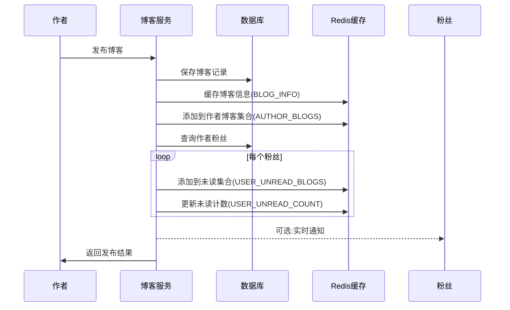
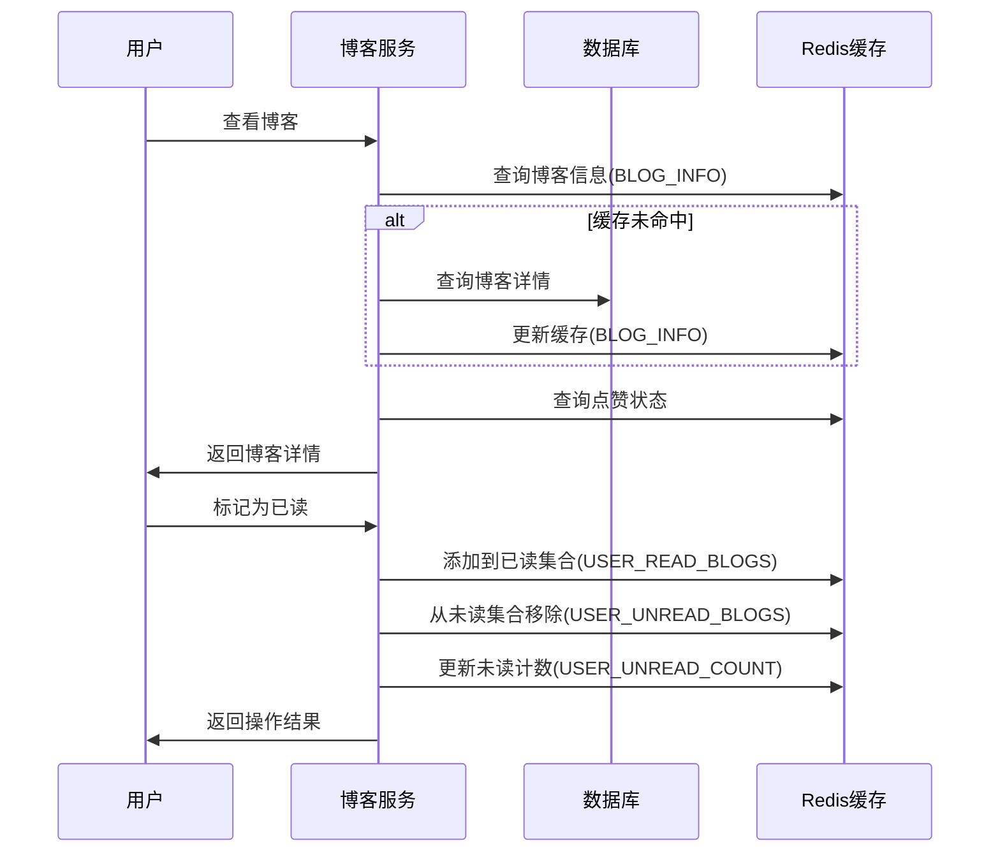
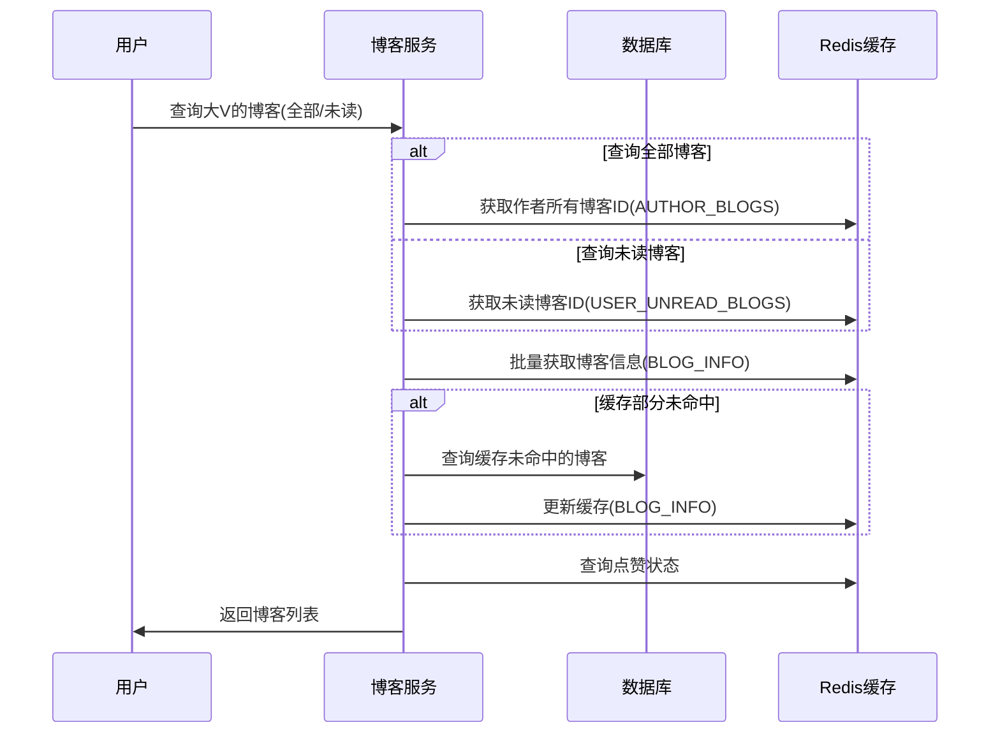

# 大V博客阅读状态Redis架构设计

**文档创建时间:** [2023-06-13 20:15:00 +08:00]  
**创建者:** Qitian Dasheng (AI) - AR  
**文档版本:** v1.0

## 更新日志

| 版本 | 时间 | 更新内容 | 更新人 |
| --- | --- | --- | --- |
| v1.0 | [2023-06-13 20:15:00 +08:00] | 初始架构设计 | Qitian Dasheng (AR) |

## 1. 架构概述

本文档定义了使用Redis优化大V博客阅读状态管理的架构设计。通过重新设计数据存储结构和查询流程，提高博客阅读状态管理的效率和准确性，特别是针对大V博客的未读/已读筛选功能。


## 2. 系统组件

### 2.1 数据存储层

#### 2.1.1 关系型数据库

- **Blog表**: 存储博客的基本信息
  - id: 博客ID
  - user_id: 作者ID
  - title: 标题
  - content: 内容
  - images: 图片
  - liked: 点赞数
  - create_time: 创建时间
  - update_time: 更新时间

#### 2.1.2 Redis缓存

- **博客信息缓存**: 使用Hash结构存储博客基本信息
- **阅读状态缓存**: 使用Set结构存储用户已读和未读博客关系
- **博客索引缓存**: 使用Set结构存储作者博客索引
- **计数缓存**: 使用Hash结构存储未读计数

### 2.2 服务层

#### 2.2.1 博客核心服务

- **博客CRUD操作**: 处理博客的创建、读取、更新和删除
- **博客查询服务**: 提供各种维度的博客查询接口
- **点赞服务**: 处理博客点赞相关操作

#### 2.2.2 阅读状态管理服务

- **阅读状态记录**: 记录和更新用户对博客的阅读状态
- **未读博客查询**: 支持按作者筛选未读博客
- **已读标记服务**: 将博客标记为已读并更新相关计数

#### 2.2.3 推送服务

- **博客推送**: 将新博客推送到粉丝的收件箱
- **未读计数更新**: 更新粉丝的未读博客计数

## 3. 数据流

### 3.1 博客发布流程



### 3.2 博客阅读流程



### 3.3 博客查询流程



## 4. 数据模型

### 4.1 Redis键设计

| 键模式 | 数据类型 | 说明 | 示例 |
|--------|----------|------|------|
| `blog:info:{blogId}` | Hash | 博客基本信息 | `blog:info:10001` -> {user_id:1001, title:"示例标题"...} |
| `user:read:{userId}` | Set | 用户已读博客ID | `user:read:1001` -> [10001, 10002, ...] |
| `author:blogs:{authorId}` | Set | 作者的所有博客ID | `author:blogs:1001` -> [10001, 10002, ...] |
| `user:unread:{userId}:{authorId}` | Set | 用户对特定作者的未读博客ID | `user:unread:2001:1001` -> [10003, 10004, ...] |
| `user:unread:count:{userId}` | Hash | 用户对各作者的未读计数 | `user:unread:count:2001` -> {1001:5, 1002:3, ...} |

### 4.2 过期策略

| 键类型 | 过期时间 | 说明 |
|--------|----------|------|
| `blog:info:{blogId}` | 7天 | 博客信息缓存7天，热门博客可延长 |
| `user:read:{userId}` | 30天 | 用户已读记录保留30天 |
| `author:blogs:{authorId}` | 永久 | 作者博客索引不过期，但可设置LRU策略 |
| `user:unread:{userId}:{authorId}` | 30天 | 未读记录保留30天 |
| `user:unread:count:{userId}` | 30天 | 未读计数保留30天 |

## 5. 接口设计

### 5.1 博客发布接口

```java
/**
 * 保存博客并推送给粉丝
 *
 * @param blog 要保存的博客对象
 * @return 保存结果
 */
Result saveBlog(Blog blog);
```

### 5.2 博客标记已读接口

```java
/**
 * 标记博客为已读
 *
 * @param id 博客id
 * @return 操作结果
 */
Result markBlogAsRead(Long id);
```

### 5.3 博客查询接口

```java
/**
 * 根据用户ID和阅读状态查询该用户的博客列表
 *
 * @param userId 用户ID
 * @param current 当前页码
 * @param size 每页大小
 * @param readStatus 阅读状态，可选值为 "ALL"(所有) 或 "UNREAD"(未读)
 * @return 查询结果，包含分页信息
 */
Result queryUserBlogByReadStatus(Long userId, Integer current, Integer size, String readStatus);
```

## 6. 性能与可用性设计

### 6.1 高性能设计

- **批量操作**: 使用Redis的pipeline减少网络往返
- **异步处理**: 博客推送和未读计数更新采用异步处理
- **缓存分层**: 热门博客采用多级缓存策略
- **合理分页**: 使用游标分页而非传统的页码分页

### 6.2 高可用设计

- **缓存降级**: Redis不可用时降级为数据库查询
- **熔断保护**: 防止缓存雪崩和缓存击穿
- **数据一致性**: 采用最终一致性模型，确保数据库和缓存最终一致
- **灾备策略**: 定期备份Redis数据，支持快速恢复

## 7. 扩展性考虑

### 7.1 水平扩展

- **数据分片**: 按用户ID或博客ID进行分片，支持集群扩展
- **读写分离**: 配置主从结构，提高读操作的性能和可用性

### 7.2 功能扩展

- **热门博客推荐**: 基于未读博客数据，构建个性化推荐
- **阅读时长分析**: 记录用户阅读时长，分析内容质量
- **社交网络分析**: 基于阅读行为，分析用户兴趣网络

## 8. 实现建议

### 8.1 核心代码模块

- **RedisService**: 封装Redis操作，提供通用的缓存接口
- **BlogCacheManager**: 管理博客相关的缓存操作
- **ReadStatusManager**: 管理阅读状态相关的操作
- **BlogFeedService**: 处理博客推送和Feed流构建

### 8.2 优先级建议

1. 首先实现博客信息缓存和已读状态管理
2. 其次实现未读博客查询功能
3. 最后实现博客推送和未读计数功能

## 9. 风险与缓解

| 风险 | 影响 | 缓解措施 |
|------|------|----------|
| Redis服务不可用 | 无法查询阅读状态 | 实现降级策略，直接查询数据库 |
| 缓存与数据库不一致 | 展示错误的阅读状态 | 定期同步和修复机制 |
| 内存使用过高 | Redis性能下降 | 合理的过期策略和内存监控 |
| 热点数据访问 | 单节点压力过大 | 实现二级缓存和本地缓存 |

## 10. 总结

本架构设计通过重新设计Redis数据结构和查询流程，显著提高了大V博客阅读状态管理的效率和准确性。特别优化了未读博客的查询性能，支持按作者维度筛选未读博客，同时保证了系统的可扩展性和高可用性。

该架构遵循KISS, YAGNI, SOLID, DRY和高内聚低耦合的设计原则，为后续功能扩展和性能优化提供了良好的基础。

## 11. 附录

### 11.1 相关技术栈

- Spring Boot
- Redis (含Lettuce/Jedis客户端)
- MySQL
- Spring Cache
- Spring AMQP (可选，用于异步处理)

### 11.2 参考资料

- Redis官方文档: https://redis.io/documentation
- Spring Data Redis文档: https://docs.spring.io/spring-data/redis/docs/current/reference/html/ 